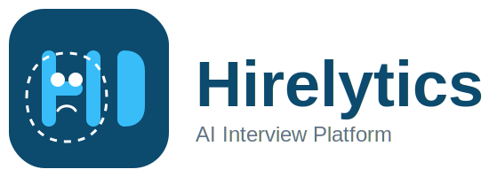

<!-- PROJECT BADGES -->
<p align="center">
  <a href="https://github.com/Shashwat2104/AI-Interview-Platform/stargazers"></a>
  <a href="https://github.com/Shashwat2104/AI-Interview-Platform/network/members"></a>
  <a href="https://github.com/Shashwat2104/AI-Interview-Platform/commits/main"></a>
  <a href="LICENSE"></a>
  <a href="#"></a>
</p>

<h1 align="center">Hirelytics</h1>
<p align="center"><b>AI-Powered Recruitment Platform</b></p>
<p align="center">🚀 <i>Modern, intelligent, and automated hiring for the next generation of teams.</i> 🚀</p>

---

## 📝 Project Info

**Project Name:** Hirelytics  
**Tagline:**  
> The all-in-one AI recruitment platform for smarter, faster, and fairer hiring.

**Description:**  
Hirelytics is a comprehensive, modern recruitment platform built with Next.js, NextAuth, and MongoDB. It empowers organizations to automate and streamline their hiring process with AI-driven interviews, real-time audio analysis, and automated candidate evaluation. Designed for admins, recruiters, and candidates, Hirelytics offers role-based dashboards, secure authentication, and a beautiful, responsive UI.

**Why?**  
Traditional hiring is slow, biased, and resource-intensive. Hirelytics leverages AI to make hiring efficient, data-driven, and accessible—helping companies find the best talent, faster.

---

## 🚀 Features

- ✅ **Role-Based Authentication** (Admin, Recruiter, Candidate)  
- ✅ **AI-Powered Interviews** (Gemini AI, Deepgram TTS, Speech Recognition)  
- ✅ **Real-Time Audio & Webcam Monitoring**  
- ✅ **Automated Candidate Evaluation & Feedback**  
- ✅ **Job Posting & Application Management**  
- ✅ **Resume Upload, Parsing, and Matching**  
- ✅ **Multi-language Support** (English, Hindi, extensible)  
- ✅ **Social Media Job Sharing**  
- ✅ **Modern UI** (Tailwind CSS, shadcn/ui, Framer Motion)  
- ✅ **Secure JWT Sessions & Form Validation**  
- ✅ **Admin Controls & Analytics**  
- ✅ **Waitlist & Registration Control**  
- ✅ **AWS S3 File Storage**  
- ✅ **Internationalization (next-intl)**  
- ✅ **Responsive & Mobile-Friendly**

---

## 📦 Tech Stack

- **Frontend:** Next.js 15 (App Router), React 19, TypeScript, Tailwind CSS, shadcn/ui, Framer Motion, TanStack React Query, next-intl, Sonner  
- **Backend:** NextAuth v5, MongoDB & Mongoose, AWS S3 (or compatible), Server Actions  
- **AI/ML:** Google Gemini AI, Deepgram API (TTS), Speech Recognition  
- **Utilities:** Zod, React Hook Form, next-share, DND Kit, Recharts, Resend (email)  
- **Dev Tools:** Husky, ESLint, Prettier, pnpm  

---

## 📷 Screenshots / Demo

<p align="center">
  
</p>

- **Live Demo:** [Coming Soon!](#)  
- **Dashboard:**  
    
- **AI Interview:**  
    
- **Mobile View:**  
  

---

## 🛠️ Installation

```bash
# Clone the repository
git clone https://github.com/Shashwat2104/AI-Interview-Platform.git
cd hirelytics

# Install dependencies
pnpm install

# Set up environment variables
cp .env.example .env.local  # Then edit .env.local with your values

# Create an admin user
pnpm tsx scripts/create-admin.ts "Admin Name" "admin@example.com" "password"

# Start the development server
pnpm dev
````

Then open [http://localhost:3000](http://localhost:3000) in your browser.

---

## 💡 Usage

**Admins:**
Manage users, jobs, applications, and view analytics from the unified dashboard.

**Recruiters:**
Post jobs, review applications, conduct AI interviews, and share job links.

**Candidates:**
Register, apply for jobs, upload resumes, and participate in AI-powered interviews.

---

## 🔐 Environment Variables

```env
# MongoDB Connection
MONGODB_URI=your_mongodb_connection_string
AUTH_URL=http://localhost:3000

# NextAuth Configuration
NEXTAUTH_SECRET=your_random_string_for_jwt_encryption
NEXTAUTH_URL=http://localhost:3000

# Email Service
RESEND_API_KEY=your_resend_api_key

# Registration Control
REGISTRATION_ENABLED=true
ADMIN_EMAIL=your_admin_email

# AWS S3 Configuration
AWS_ACCESS_KEY_ID=your_aws_access_key
AWS_SECRET_ACCESS_KEY=your_aws_secret_key
AWS_REGION=auto
AWS_ENDPOINT_URL_S3=https://your-s3-endpoint
AWS_BUCKET_NAME=your_bucket_name

# AI Services
GOOGLE_API_KEY=your_google_api_key_for_gemini_ai
DEEPGRAM_API_KEY=your_deepgram_api_key_for_tts
```

---

## 🧪 Tests

Run all tests (if available):

```bash
pnpm test
```

Lint and format code:

```bash
pnpm lint
pnpm format
```

---

## 🤝 Contributing

1. Fork the repository
2. Create your feature branch:

   ```bash
   git checkout -b feature/amazing-feature
   ```
3. Commit your changes:

   ```bash
   git commit -m 'Add some amazing feature'
   ```
4. Push to the branch:

   ```bash
   git push origin feature/amazing-feature
   ```
5. Open a Pull Request

Please read our **Code of Conduct** before contributing.
See `CONTRIBUTING.md` for detailed guidelines.

---

## 📄 License

This project is licensed under the **MIT License**.

---

## 🙋‍♂️ Author / Maintainer

**Your Name**
[GitHub](https://github.com/yourusername) | [Website](#) | [Contact](#)

---

## 🌐 Badges

<p align="center">
  
  
  
  
  
</p>

---

## 📌 Optional

### FAQ

**Q: Can I use my own AI model?**
A: The platform is designed for Gemini AI but can be extended.

**Q: Is there a mobile app?**
A: Mobile support is planned in the roadmap.

---

### Roadmap

* [ ] Mobile application
* [ ] Calendar integration
* [ ] Enhanced resume parsing
* [ ] Video interview recording
* [ ] ATS integration
* [ ] More languages
* [ ] Advanced analytics

---

### Known Issues

See GitHub [Issues](https://github.com/Shashwat2104/AI-Interview-Platform/issues)

---

### Acknowledgments

* [Next.js](https://nextjs.org)
* [MongoDB](https://www.mongodb.com/)
* [Google Gemini AI](https://deepmind.google/technologies/gemini/)
* [Deepgram](https://www.deepgram.com/)
* [shadcn/ui](https://ui.shadcn.com/)
* [Tailwind CSS](https://tailwindcss.com/)


