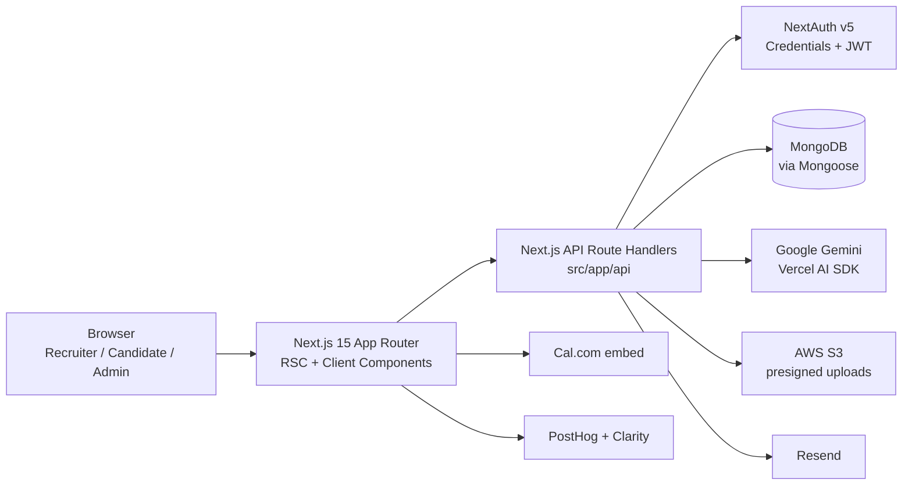
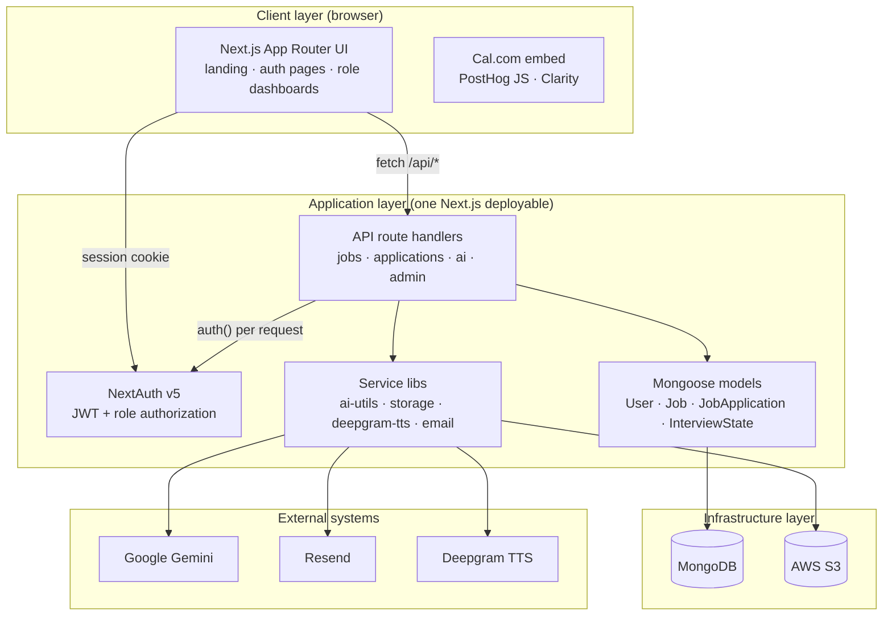
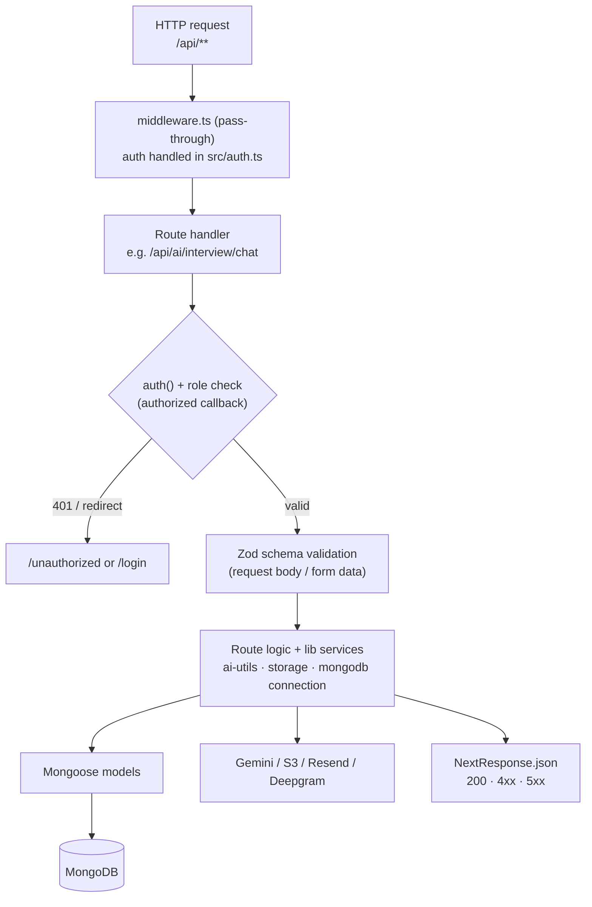
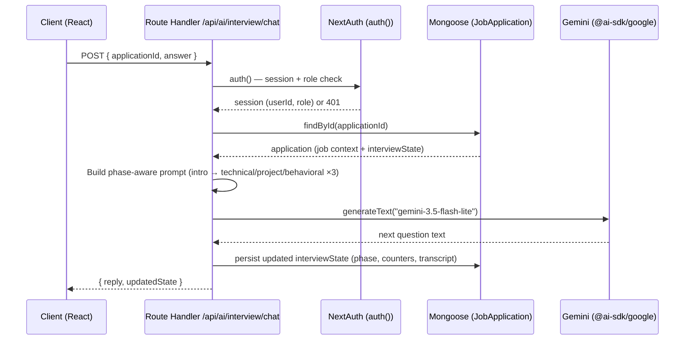
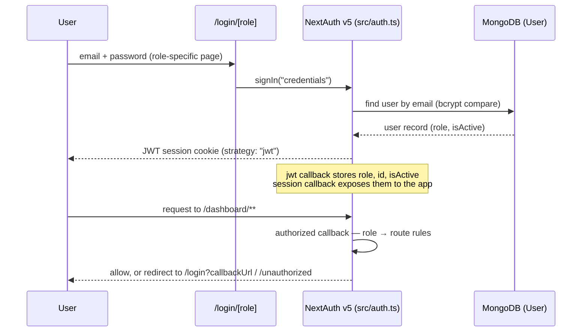
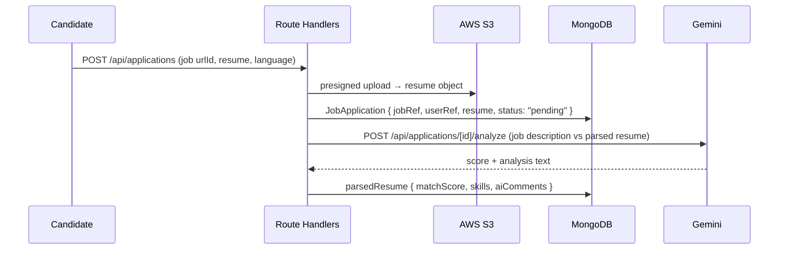
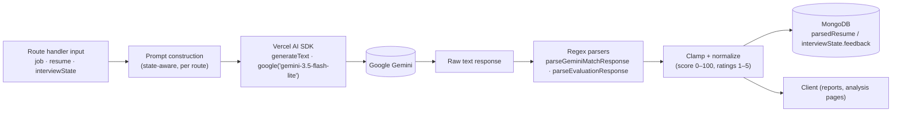
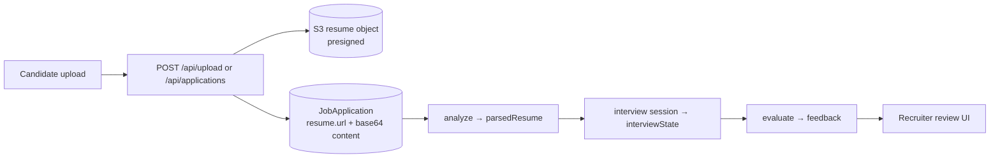
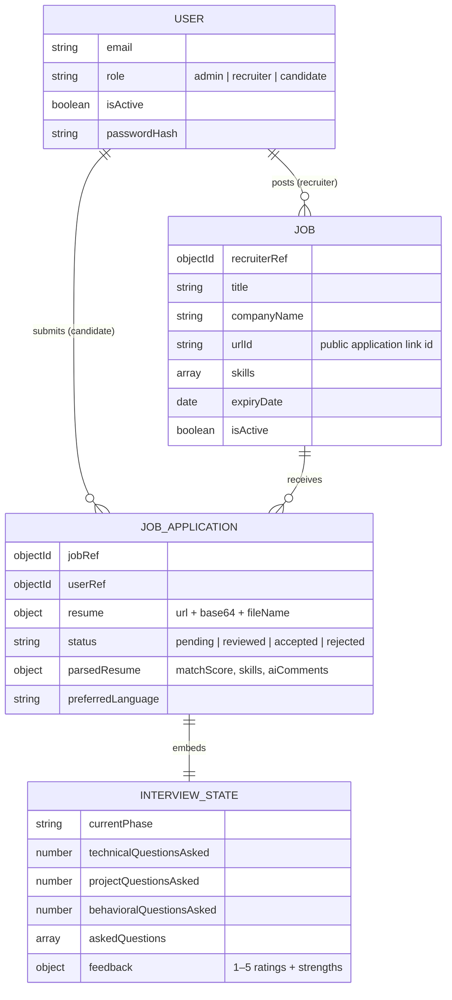

# Hirelytics

> AI-powered interview and hiring platform built as a single Next.js 15 application.

**Live deployment: [shashwat-ai-interview-platform.vercel.app](https://shashwat-ai-interview-platform.vercel.app/)**

[Architecture Reference](https://shashwat-ai-interview-platform.vercel.app/docs/hirelytics-architecture.html) · [Hiring Workflow](https://shashwat-ai-interview-platform.vercel.app/docs/hirelytics-hiring-workflow.html) · [API Architecture](#api-architecture)

---

## Overview

Hirelytics lets recruiters post jobs (with AI-generated descriptions), collect candidate
applications through unique job links, screen resumes with LLM-based match scoring, run
structured AI interview sessions with voice, and review generated scoring reports before making
a hiring decision.

The entire stack — UI, REST API route handlers, and AI orchestration — ships as **one Next.js 15
App Router deployable**. Durable state lives in MongoDB via Mongoose; resumes are stored in
AWS S3 through presigned uploads; Google Gemini (via the Vercel AI SDK) provides job-description
generation, resume match analysis, interview conversation, and final evaluation.

## Architecture at a Glance


```mermaid
flowchart LR
    B["Browser<br/>Recruiter / Candidate / Admin"] --> UI["Next.js 15 App Router<br/>RSC + Client Components"]
    UI --> API["Next.js API Route Handlers<br/>src/app/api"]
    API --> AUTH["NextAuth v5<br/>Credentials + JWT"]
    API --> DB[("MongoDB<br/>via Mongoose")]
    API --> AI["Google Gemini<br/>Vercel AI SDK"]
    API --> S3["AWS S3<br/>presigned uploads"]
    API --> MAIL["Resend"]
    UI --> CAL["Cal.com embed"]
    UI --> OBS["PostHog + Clarity"]
```

| Layer | Technology | Code |
|---|---|---|
| Client | Next.js 15 App Router (React 19), Tailwind CSS v4, shadcn/ui, TanStack Query/Table | `src/app`, `src/components` |
| API | Next.js route handlers (`NextRequest`/`NextResponse`) | `src/app/api` |
| Auth | NextAuth v5 (Auth.js), Credentials provider, JWT sessions, bcrypt | `src/auth.ts` |
| Domain models | Mongoose schemas | `src/models` |
| AI | Google Gemini through `@ai-sdk/google` / Vercel AI SDK | `src/lib/ai-utils.ts`, `src/app/api/ai` |
| Storage | AWS S3 + presigned URLs | `src/lib/s3-client.ts`, `src/lib/storage.ts` |
| Voice | Deepgram TTS (interviewer speech) | `src/lib/deepgram-tts.ts` |
| Email | Resend | `src/lib/email` |
| Observability | PostHog (client + server), Microsoft Clarity, Vercel Analytics | `src/lib/posthog.ts`, `src/lib/microsoft-clarity.ts` |

## High-Level Architecture


```mermaid
flowchart TB
    subgraph Client["Client layer (browser)"]
        UI["Next.js App Router UI<br/>landing · auth pages · role dashboards"]
        EMBEDS["Cal.com embed<br/>PostHog JS · Clarity"]
    end

    subgraph App["Application layer (one Next.js deployable)"]
        HANDLERS["API route handlers<br/>jobs · applications · ai · admin"]
        AUTH["NextAuth v5<br/>JWT + role authorization"]
        MODELS["Mongoose models<br/>User · Job · JobApplication · InterviewState"]
        LIB["Service libs<br/>ai-utils · storage · deepgram-tts · email"]
    end

    subgraph Infra["Infrastructure layer"]
        MONGO[("MongoDB")]
        S3[("AWS S3")]
    end

    subgraph Ext["External systems"]
        GEMINI["Google Gemini"]
        RESEND["Resend"]
        DEEPGRAM["Deepgram TTS"]
    end

    UI -->|"fetch /api/*"| HANDLERS
    UI -->|"session cookie"| AUTH
    HANDLERS -->|"auth() per request"| AUTH
    HANDLERS --> MODELS
    MODELS --> MONGO
    HANDLERS --> LIB
    LIB --> GEMINI
    LIB --> S3
    LIB --> DEEPGRAM
    LIB --> RESEND
```

There is no separate backend service: route handlers are the controllers, `src/lib` modules are
the service layer, and `src/models` is the data-access layer. The client is server-rendered by
the same deployment that serves the API.

## Low-Level Request Pipeline

Actual flow for a mutating API call (no separate middleware/controller classes exist —
Next.js route handlers play both roles):


```mermaid
flowchart TB
    REQ["HTTP request<br/>/api/**"] --> MW["middleware.ts (pass-through)<br/>auth handled in src/auth.ts"]
    MW --> HANDLER["Route handler<br/>e.g. /api/ai/interview/chat"]
    HANDLER --> SESSION{"auth() + role check<br/>(authorized callback)"}
    SESSION -->|"401 / redirect"| UNAUTH["/unauthorized or /login"]
    SESSION -->|"valid"| ZOD["Zod schema validation<br/>(request body / form data)"]
    ZOD --> LOGIC["Route logic + lib services<br/>ai-utils · storage · mongodb connection"]
    LOGIC --> MONGOOSE["Mongoose models"]
    MONGOOSE --> DB[("MongoDB")]
    LOGIC --> EXT["Gemini / S3 / Resend / Deepgram"]
    LOGIC --> RESP["NextResponse.json<br/>200 · 4xx · 5xx"]
```

Route protection is centralized: `src/auth.ts` implements an `authorized` callback that maps
request paths to required roles and redirects to `/login?callbackUrl=…` or `/unauthorized`.
`src/middleware.ts` is intentionally a pass-through. Dashboard role layouts additionally call
`auth()` server-side and redirect on mismatch.

## Request Lifecycle

Typical authenticated mutation (example: submitting an interview chat turn):


```mermaid
sequenceDiagram
    participant C as Client (React)
    participant H as Route Handler /api/ai/interview/chat
    participant A as NextAuth (auth())
    participant M as Mongoose (JobApplication)
    participant G as Gemini (@ai-sdk/google)

    C->>H: POST { applicationId, answer }
    H->>A: auth() — session + role check
    A-->>H: session (userId, role) or 401
    H->>M: findById(applicationId)
    M-->>H: application (job context + interviewState)
    H->>H: Build phase-aware prompt (intro → technical/project/behavioral ×3)
    H->>G: generateText("gemini-3.5-flash-lite")
    G-->>H: next question text
    H->>M: persist updated interviewState (phase, counters, transcript)
    H-->>C: { reply, updatedState }
```

Validation is primarily client-side (React Hook Form + Zod); route handlers re-check session,
role, and required identifiers server-side. Errors are returned as JSON with `NextResponse` and
surfaced in the UI through `sonner` toasts; unexpected render errors hit the App Router error
boundary (`src/app/error.tsx`).

## Authentication Flow

Single mechanism: NextAuth v5 Credentials provider. There is no OAuth, no refresh-token flow,
and no separate admin identity provider.


```mermaid
sequenceDiagram
    participant U as User
    participant L as /login/[role]
    participant NA as NextAuth v5 (src/auth.ts)
    participant M as MongoDB (User)

    U->>L: email + password (role-specific page)
    L->>NA: signIn("credentials")
    NA->>M: find user by email (bcrypt compare)
    M-->>NA: user record (role, isActive)
    NA-->>U: JWT session cookie (strategy: "jwt")
    Note over NA: jwt callback stores role, id, isActive<br/>session callback exposes them to the app
    U->>NA: request to /dashboard/**
    NA->>NA: authorized callback — role → route rules
    NA-->>U: allow, or redirect to /login?callbackUrl / /unauthorized
```

Roles: `admin`, `recruiter`, `candidate` (Zod-validated at sign-in). Authorization lives in the
`authorized` callback plus server-side `auth()` checks in the dashboard role layouts
(`dashboard/(candidate|recruiters|admin)/layout.tsx`). Disabling a user (`isActive`) propagates
through the session token.

## Core Business Flows

### 1. Job posting with AI description

1. Recruiter fills the job form (`/dashboard/job-listing`, `JobFormDialog`).
2. "Generate with AI" calls `POST /api/ai/generate-job-description` once title/company/skills
   are present.
3. `generateGeminiText` produces the description; the recruiter edits the result before submit.
4. `POST /api/jobs` persists the `Job` (including a public `urlId` used for unique application
   links).

### 2. Application and resume screening


```mermaid
sequenceDiagram
    participant C as Candidate
    participant API as Route Handlers
    participant S3 as AWS S3
    participant M as MongoDB
    participant G as Gemini

    C->>API: POST /api/applications (job urlId, resume, language)
    API->>S3: presigned upload → resume object
    API->>M: JobApplication { jobRef, userRef, resume, status: "pending" }
    API->>G: POST /api/applications/[id]/analyze (job description vs parsed resume)
    G-->>API: score + analysis text
    API->>M: parsedResume { matchScore, skills, aiComments }
```

### 3. AI interview session

1. Candidate opens the pre-flight page (device check: camera + microphone), then the live
   session at `/dashboard/applications/[id]/interview/session`.
2. `POST /api/ai/interview/init` builds the greeting prompt from the job + resume context.
3. Each turn posts to `POST /api/ai/interview/chat`, which loads the embedded
   `interviewState` (phase: introduction → technical / project / behavioral, 3 questions per
   category), generates the next question, and persists the updated state.
4. The client records via Web Speech API / microphone, uploads webcam snapshots to
   `POST /api/applications/[id]/monitoring` every 30 s (stored in S3).
5. A timer can trigger `POST /api/ai/interview/interrupt`; evaluation is available through
   `POST /api/ai/interview/evaluate` and a trigger-style `GET /api/ai/interview/autoevaluate`.

### 4. Scoring, review, decision

`evaluate` parses Gemini output into structured ratings (technical skills, communication,
problem solving, cultural fit — 1–5 — plus strengths and improvement areas) and persists them in
`interviewState.feedback`. Recruiters review match score + report + monitoring snapshots on
`/dashboard/job-applications/[id]`, then set the application status; the candidate is notified
via the application status endpoint.

## AI / LLM Layer


```mermaid
flowchart LR
    IN["Route handler input<br/>job · resume · interviewState"] --> P["Prompt construction<br/>(state-aware, per route)"]
    P --> SDK["Vercel AI SDK<br/>generateText · google('gemini-3.5-flash-lite')"]
    SDK --> G[("Google Gemini")]
    G --> RAW["Raw text response"]
    RAW --> PARSE["Regex parsers<br/>parseGeminiMatchResponse · parseEvaluationResponse"]
    PARSE --> VAL["Clamp + normalize<br/>(score 0–100, ratings 1–5)"]
    VAL --> M[("MongoDB<br/>parsedResume / interviewState.feedback")]
    VAL --> C["Client (reports, analysis pages)"]
```

Facts worth knowing before changing this layer:

- **Provider**: Google Gemini through `@ai-sdk/google`; model id `gemini-3.5-flash-lite`
  (default in `ai-utils.ts`, passed explicitly per call).
- **Non-streaming**: every call uses `generateText`; there is no `streamText` path.
- **Structured output is regex-parsed**, not schema-decoded: match analysis expects
  `Score:` / `Analysis:` / skills sections; evaluation expects
  `TECHNICAL_SKILLS:`-style markers. Parsing is defensive (fallbacks when sections are missing).
- **Error handling**: `ai-utils` logs and rethrows; route handlers translate failures into 5xx
  JSON responses. There is no retry, timeout, or fallback-model logic.
- **State**: interview continuity is persisted per application in the embedded
  `interviewState` document, not in provider memory.

## Data Flow

Resume data moves through the system once, at application time:


```mermaid
flowchart LR
    C["Candidate upload"] --> U["POST /api/upload or /api/applications"]
    U --> S3[("S3 resume object<br/>presigned")]
    U --> M[("JobApplication<br/>resume.url + base64 content")]
    M --> AN["analyze → parsedResume"]
    AN --> IV["interview session → interviewState"]
    IV --> EV["evaluate → feedback"]
    EV --> R["Recruiter review UI"]
```

## Database Architecture

MongoDB (single `MONGODB_URI`), accessed exclusively through Mongoose models in `src/models`;
`src/lib/mongodb.ts` owns the connection (cached in dev to survive HMR).


```mermaid
erDiagram
    USER ||--o{ JOB : "posts (recruiter)"
    USER ||--o{ JOB_APPLICATION : "submits (candidate)"
    JOB ||--o{ JOB_APPLICATION : "receives"
    JOB_APPLICATION ||--|| INTERVIEW_STATE : "embeds"
    USER {
        string email
        string role "admin | recruiter | candidate"
        boolean isActive
        string passwordHash
    }
    JOB {
        objectId recruiterRef
        string title
        string companyName
        string urlId "public application link id"
        array skills
        date expiryDate
        boolean isActive
    }
    JOB_APPLICATION {
        objectId jobRef
        objectId userRef
        object resume "url + base64 + fileName"
        string status "pending | reviewed | accepted | rejected"
        object parsedResume "matchScore, skills, aiComments"
        string preferredLanguage
    }
    INTERVIEW_STATE {
        string currentPhase
        number technicalQuestionsAsked
        number projectQuestionsAsked
        number behavioralQuestionsAsked
        array askedQuestions
        object feedback "1–5 ratings + strengths"
    }
```

Design notes:

- `interviewState` is **embedded** in `JobApplication`, so interview continuity is read and
  written in a single-document operation.
- Resume file bytes are kept in S3; the application document also stores the resume **base64
  content** alongside the URL — duplicated storage is a deliberate read-optimization trade-off
  (see [Trade-offs](#technical-trade-offs)).
- Standalone collections `Contact` and `Wishlist` power the admin contact-submissions and
  waitlist pages.
- No explicit indexes beyond `ref` fields were observed; compound indexes (e.g. `jobId` +
  `status`) would be a recommended improvement for large collections.

## API Architecture

Route handlers live under `src/app/api`, grouped by domain. JSON in / JSON out via
`NextResponse`. There is no versioning (`/v1`) and no OpenAPI spec; the handlers are the
contract.

| Group | Endpoints (representative) | Auth | Purpose |
|---|---|---|---|
| `auth` | NextAuth catch-all, legacy login | public | Session issuance |
| `register` | `POST /api/register` | public | Account creation (gated by `REGISTRATION_ENABLED`) |
| `jobs` | CRUD, `/jobs/list` (public, paginated + filters), `/jobs/recruiter/list` | mixed | Job posting and browsing |
| `applications` | apply, get/patch, `analyze`, `status`, `monitoring`, `monitoring-image` | candidate/recruiter | Application lifecycle |
| `ai` | `generate-job-description`, `interview/{init,chat,evaluate,autoevaluate,history,interrupt,state}` | candidate/recruiter | AI orchestration |
| `dashboard/stats` | per-role aggregates | authenticated | Dashboard cards |
| `admin/*` | users, jobs management | admin | Platform administration |
| `upload`, `files`, `storage` | S3 upload, presigned URLs, storage proxy | authenticated | Resume storage |

## Asynchronous Processing

There are **no queues, workers, cron jobs, or WebSockets**. Concurrency is handled with plain
HTTP semantics:

- AI calls run synchronously inside route handlers; clients show loading states.
- Interview monitoring snapshots are uploaded **by the client** on a 30 s interval.
- Interview evaluation can be re-triggered through `GET /api/ai/interview/autoevaluate`.
- TanStack Query drives client-side refetching (e.g. live interview state).

If interview evaluation moves off the request path, the natural seam is a queue worker invoked
by the `autoevaluate` trigger — recommended improvement, not current architecture.

## External Integrations

| Integration | Purpose | Direction | Code |
|---|---|---|---|
| Google Gemini (`@ai-sdk/google`) | JD generation, resume match analysis, interview chat, evaluation | Outbound | `src/lib/ai-utils.ts` |
| AWS S3 (`@aws-sdk/client-s3`, `s3-request-presigner`) | Resume storage, presigned uploads, monitoring snapshots | Outbound + inbound (presigned PUT) | `src/lib/s3-client.ts`, `src/lib/storage.ts` |
| Deepgram | Interviewer text-to-speech | Outbound | `src/lib/deepgram-tts.ts` |
| Resend | Transactional email (application status) | Outbound | `src/lib/email` |
| Cal.com (`@calcom/embed-react`) | Scheduling embed on demo/booking pages | Inbound (embedded) | `src/app/demo/book/page.tsx` |
| PostHog (`posthog-js`, `posthog-node`) | Product analytics | Outbound | `src/lib/posthog.ts` |
| Microsoft Clarity | Session replay | Inbound (script) | `src/lib/microsoft-clarity.ts` |
| Vercel Analytics | Web analytics | Inbound (script) | `src/app/layout.tsx` |

## Error Handling

- **AI layer**: `ai-utils` wraps every call, logs the model + prompt + error to the console, and
  rethrows; route handlers return 5xx JSON.
- **LLM output**: regex parsers degrade gracefully (missing sections → `undefined` fields,
  score clamped to 0–100, ratings clamped to 1–5) rather than failing the request.
- **Routes**: missing documents → 404; invalid session/role → 401/redirect via `authorized`.
- **Client**: `sonner` toasts for user-facing failures; shared `EmptyState` / `ErrorState`
  components with retry; App Router `error.tsx` and `not-found.tsx` boundaries.
- No error-tracking service (e.g. Sentry) is integrated — recommended improvement.

## Observability

```text
Application
 ├── posthog-js (client events) ──┐
 ├── posthog-node (server events) ├─→ PostHog
 ├── Microsoft Clarity (replay) ──┘
 ├── Vercel Analytics (page metrics)
 └── console.error / console.log (stdout of the host platform)
```

There is no structured logging, correlation-ID propagation, metrics endpoint, or tracing.
Health is implicitly observed via `GET /api/test-s3` (S3 connectivity check).

## Security

Implemented:

- **Authentication**: NextAuth v5 JWT sessions (`AUTH_SECRET`); passwords hashed with bcrypt.
- **Authorization**: role rules centralized in the `authorized` callback; server-side `auth()`
  re-checks in dashboard layouts; admin API group guarded by role.
- **Input validation**: Zod schemas on forms (client) and required-field checks in models.
- **Storage**: S3 access through presigned URLs; bucket credentials stay server-side.
- **Registration flag**: `REGISTRATION_ENABLED` can disable public sign-ups.

Recommended improvements (not currently implemented):

> - Server-side Zod validation for every route handler body (some routes trust client forms).
> - Rate limiting on `/api/ai/*` and `/api/auth/*` (no limiter exists).
> - Security headers / CSP configuration (not present in `next.config.ts`).
> - Removing the resume base64 duplicate from MongoDB, or encrypting it at rest.
> - Explicit MongoDB indexes on hot query paths.

## Configuration

All configuration is environment-based (`.env`, loaded by Next.js). Variable names as used in
code:

```env
# Database
MONGODB_URI=<mongodb connection string>

# Auth (NextAuth v5)
AUTH_SECRET=<secret>            # NEXTAUTH_SECRET also accepted
AUTH_URL=<app base url>         # NEXTAUTH_URL also accepted
AUTH_TRUST_HOST=true

# AI (Gemini via Vercel AI SDK)
GOOGLE_GENERATIVE_AI_API_KEY=<api-key>   # GOOGLE_API_KEY / GOOGLE_GEMINI_API_KEY aliases

# Storage (AWS S3)
AWS_ACCESS_KEY_ID=<key>
AWS_SECRET_ACCESS_KEY=<secret>
AWS_REGION=<region>
AWS_BUCKET_NAME=<bucket>
AWS_ENDPOINT_URL_S3=<optional custom endpoint>

# Voice
DEEPGRAM_API_KEY=<api-key>

# Email
RESEND_API_KEY=<api-key>

# Analytics (public)
NEXT_PUBLIC_POSTHOG_KEY=<key>
NEXT_PUBLIC_MICROSOFT_CLARITY_PROJECT_ID=<id>

# Feature flags / ops
REGISTRATION_ENABLED=true
ADMIN_EMAIL=<platform admin email>
```

## Local Development

Prerequisites: Node.js 20+, pnpm, and a MongoDB instance (local or Atlas).

```bash
pnpm install

# Option A — local MongoDB managed by the repo script (data in .mongo-data/)
pnpm dev:mongo

# Option B — point MONGODB_URI at your own instance, then:
pnpm dev            # http://localhost:3000 (Turbopack)

# Seed demo accounts (recruiter / candidate / admin used on the login pages)
pnpm seed:demo
```

Useful commands: `pnpm build` (production build + typecheck), `pnpm lint`, `pnpm format`,
`pnpm lint:fix`. Husky + lint-staged + commitlint run on commit.

## Build & Deployment

No Dockerfile, CI workflow, or IaC is committed. The deployment unit is a standard Next.js
build:

```text
git push → (host CI) → pnpm install → next build → node server / Vercel
```

`@vercel/analytics` and Vercel conventions indicate Vercel hosting; the environment variables
above must be configured on the host. API route handlers and the AI/AWS paths require the
Node.js runtime.

The production deployment runs at
**[https://shashwat-ai-interview-platform.vercel.app/](https://shashwat-ai-interview-platform.vercel.app/)**.

## Testing

There is currently **no automated test suite** (no test runner in `package.json`). Quality is
guarded by TypeScript strict checks in `next build`, ESLint (`next lint`), Prettier, and
Husky pre-commit hooks. Introducing Vitest + Playwright for the interview flow would be the
highest-value first addition.

## Architecture Decisions

- **Single Next.js deployable (UI + API together).**
  Reason: removes cross-service auth/deployment overhead for a small team.
  Trade-off: AI-heavy handlers and UI scale together; a split becomes worthwhile if AI load
  dominates.

- **Authorization centralized in `auth.ts` (`authorized` callback) instead of middleware.**
  Reason: one place maps roles to route rules; `middleware.ts` stays a pass-through.
  Trade-off: less discoverable than a conventional middleware chain — documented here for that
  reason.

- **Interview state embedded in the application document.**
  Reason: interview turns read and write in one atomic document operation; no joins.
  Trade-off: document growth per application; state cannot be queried independently.

- **Synchronous AI inside route handlers, parsed with regex.**
  Reason: simplest possible request/response shape; no queue infrastructure to run.
  Trade-off: long Gemini calls block the HTTP response; output format is contract-by-prompt and
  more brittle than structured decoding.

- **Resume bytes in S3 *and* base64 in MongoDB.**
  Reason: the Mongo copy gives the analysis pipeline and resume viewer a fast local read.
  Trade-off: doubled storage and larger documents.

## Technical Trade-offs

| Topic | Choice | Alternative not taken |
|---|---|---|
| AI output contract | Regex parsing of free-form Gemini text | JSON-mode / structured decoding (`generateObject`) |
| Async work | Synchronous handlers, client-driven polling | Queue + worker for evaluation |
| Sessions | Stateless JWT with role claims | Database sessions (instant `isActive` revocation) |
| Database | Single MongoDB, embedded interview state | SQL with normalized interview tables |
| Validation | Client-led Zod, server re-checks session/role only | Full server-side schema validation everywhere |

## Architecture Reference

For the complete interactive architecture — component map, hiring-pipeline workflow, guided
views, and relationship tracing — see:

**[Open the Interactive Architecture →](https://shashwat-ai-interview-platform.vercel.app/docs/hirelytics-architecture.html)**
**[Open the Hiring Workflow →](https://shashwat-ai-interview-platform.vercel.app/docs/hirelytics-hiring-workflow.html)**

The artifacts are served from `public/docs/` so they resolve on the deployed site; the editable
spec sources live in `docs/`.

## Contributing

- Conventional Commits enforced via commitlint; Husky + lint-staged run ESLint and Prettier on
  staged files.
- `pnpm lint:fix` and `pnpm format` before pushing; `pnpm build` must pass (it includes the
  TypeScript check).
- Keep the architecture documentation honest: if you change a flow documented here or in
  `docs/*.json`, update both.
